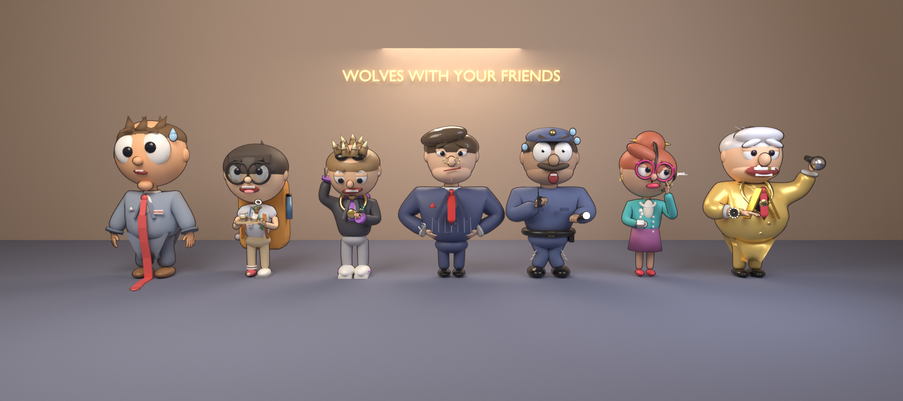

# Wolves With Your Friends

A chaotic co-op Roblox party game for up to 10 players. Ridiculous-looking brokers race for ringing computers on the 100th floor of a luxury tower, talk AI clients into deals out loud, and hit a daily target before The Chairman fires everyone.

Design doc: https://claude.ai/code/artifact/6cd9f355-ac00-49a9-863d-b4de69d8489c



## Layout

| Folder | What's in it |
| --- | --- |
| `blender/` | Python scripts that build every character in Blender, plus the saved `.blend` scenes |
| `renders/` | Preview renders |
| `blender/export/` | Roblox-ready FBX files + baked textures (`python3 export_roblox.py`) |
| `roblox/` | The Roblox game: open `roblox/WolvesWithYourFriends.rbxl` in Studio, see `roblox/README.md` |

## Rebuilding the characters

The models are generated from code with Blender's Python module (`pip install bpy`, Python 3.11):

```sh
cd blender
python3 characters.py   # Rookie Broker + The Chairman -> heroes.blend
python3 cast.py         # Intern, Crypto Bro, CEO, Security Guard, Receptionist -> cast.blend
python3 lineup.py       # everyone together -> full_cast.blend + renders/full_cast.png
```

`lib.py` holds the shape helpers (skin-modifier bodies, five-finger hands, outlines, studio lighting); `parts.py` holds shared parts (eyes, watches, phones, legs).
